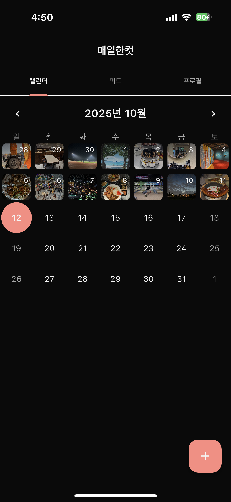
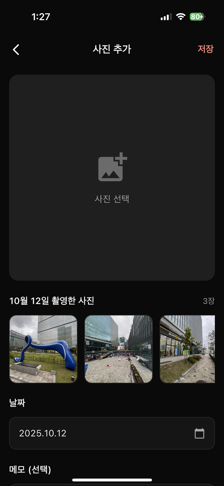

<h1 align="center">매일한컷 (Everyday Shot)</h1>
<p align="center">
  
</p>
<p align="center">
  <strong>하루에 한 장, 특별한 순간을 기록하세요</strong>
</p>

<p align="center">
  매일한컷은 하루에 단 한 장의 사진만 저장할 수 있는 미니멀한 사진 일기 앱입니다.<br>
  매일의 소중한 순간을 선택하고, 간단한 메모와 함께 저장하여 나만의 시간을 기록하세요.
</p>

---

## 📷 앱 화면

<p align="center">
  
  
  
  
</p>

<p align="center">
  <em>캘린더 뷰 &nbsp;&nbsp;|&nbsp;&nbsp; 업로드 뷰 &nbsp;&nbsp;|&nbsp;&nbsp; 피드 뷰 &nbsp;&nbsp;|&nbsp;&nbsp; 프로필 뷰</em>
</p>

---

## 📱 앱 다운로드

- 🍎 [App Store에서 설치하기](https://apps.apple.com/kr/app/%EB%A7%A4%EC%9D%BC%ED%95%9C%EC%BB%B7/6753706016)
- 📲 **Google Play**: (비공개 테스트 중)

---

## ✨ 주요 기능

| 기능                   | 설명                                |
| ---------------------- | ----------------------------------- |
| 📅 **하루 한 장**      | 오늘의 가장 의미 있는 순간을 선택   |
| 🔐 **소셜 로그인**     | Google, 카카오 간편 로그인 지원     |
| 📝 **메모 작성**       | 사진과 함께 짧은 메모를 남기기      |
| 📱 **캘린더 뷰**       | 매일의 기록을 달력에서 한눈에 확인  |
| 📰 **피드 뷰**         | 최신 사진부터 시간순으로 탐색       |
| 👤 **프로필 갤러리**   | 그리드 형태로 모든 사진 한눈에 보기 |
| ☁️ **클라우드 동기화** | Firebase 기반 안전한 데이터 저장    |

---

## 🚀 로컬 개발 환경 설정

<details>
<summary><strong>설치 및 실행 방법 보기</strong></summary>

### 사전 요구사항

- Flutter SDK 3.5.4 이상
- Firebase 프로젝트 설정
- iOS: Xcode, CocoaPods
- Android: Android Studio

### 설치

```bash
# 저장소 클론
git clone https://github.com/yourusername/everyday_shot.git
cd everyday_shot

# 패키지 설치
flutter pub get

# iOS Pod 설치 (iOS만 해당)
cd ios && pod install && cd ..

# 실행
flutter run
```

### 환경 변수 설정

프로젝트 루트에 `.env` 파일을 생성하고 카카오 앱 키를 설정하세요:

```env
# Kakao Login
KAKAO_NATIVE_APP_KEY=your_kakao_native_app_key_here
```

**카카오 앱 키 발급:**

1. [Kakao Developers](https://developers.kakao.com)에서 애플리케이션 생성
2. 내 애플리케이션 > 앱 키 > 네이티브 앱 키 복사
3. 플랫폼 설정에서 iOS Bundle ID, Android 패키지명 등록

### Firebase 설정

1. [Firebase Console](https://console.firebase.google.com)에서 프로젝트 생성
2. iOS/Android 앱 등록
3. `google-services.json` (Android), `GoogleService-Info.plist` (iOS) 다운로드
4. 각각 `android/app/`, `ios/Runner/` 디렉토리에 배치
5. Firebase Authentication, Firestore, Storage 활성화

### iOS 추가 설정

Xcode에서 프로젝트를 열고:

1. Runner > Build Settings > User-Defined
2. `+` 버튼 클릭
3. `KAKAO_APP_KEY` 추가하고 값 설정 (카카오 앱 키)

</details>

---

## 📝 라이선스

개인 프로젝트입니다.

---

<p align="center">
  <strong>매일한컷을 사용해주셔서 감사합니다</strong><br>
  하루에 한 장의 사진으로, 소중한 순간들을 기록해보세요 📷✨
</p>
